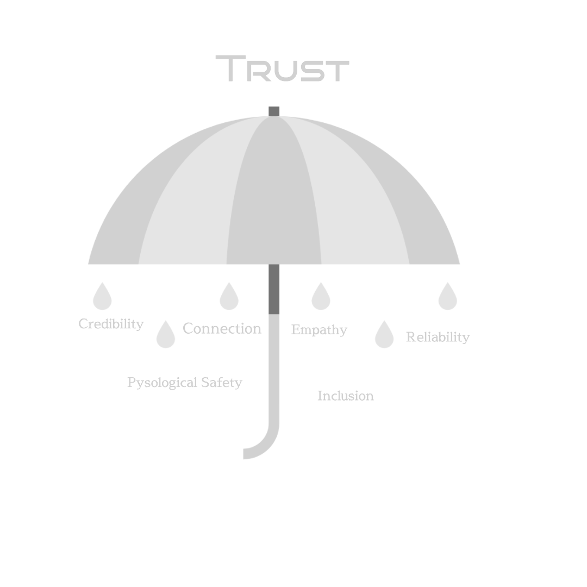

### Psychological Safety ###

Psychological Safety it is different from trust 

Its very common we hear that _its ok to make the mistake_ but the real challenge is we often forget to Ask the very important question 
- How hard you tried ? 
- how much effort you put in ? 
- Did we set the expectation to our employee when we say _its ok to make the mistake_ ?

    working our best and we can make mistakes.
The team lead and the manager encourage the team member to take risks.

    Trust :
        Reliability and credibility

        Connection and Empathy

        if Trust a bigger umbrella where Psychological safety is just a component.

        Creativity and innovation cannot happen without Risk.
        Most effective team has element to take risk. 

        BITS Model

        Effective team formation 

            Belonging 
            Inclusion 
            Trust 
            Safety
            
    Safety first then Trust followed by Inclusion and Belonging.

    
Negativity Bias 

Pay attention to that causes danger

